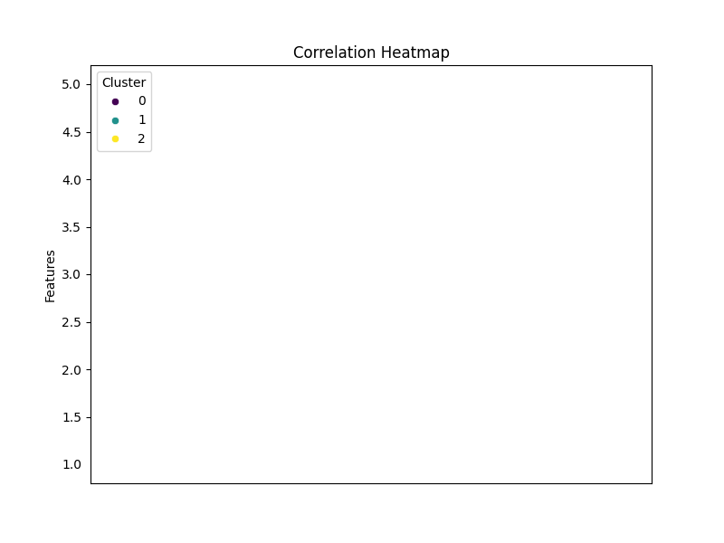
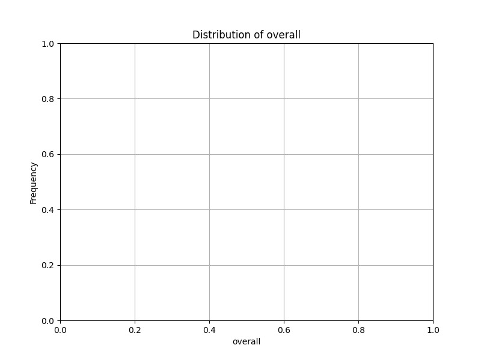
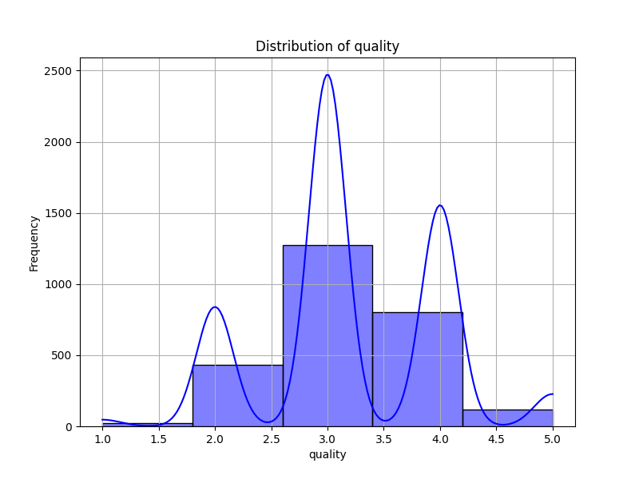
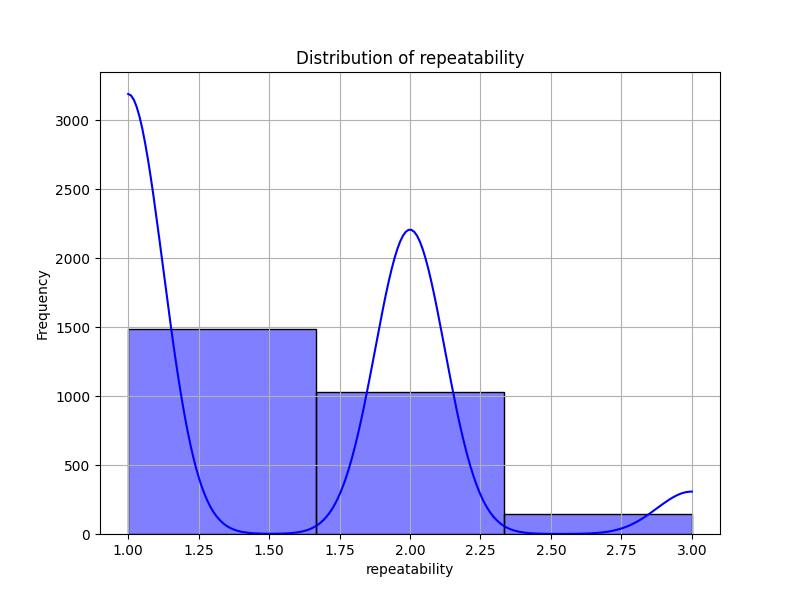
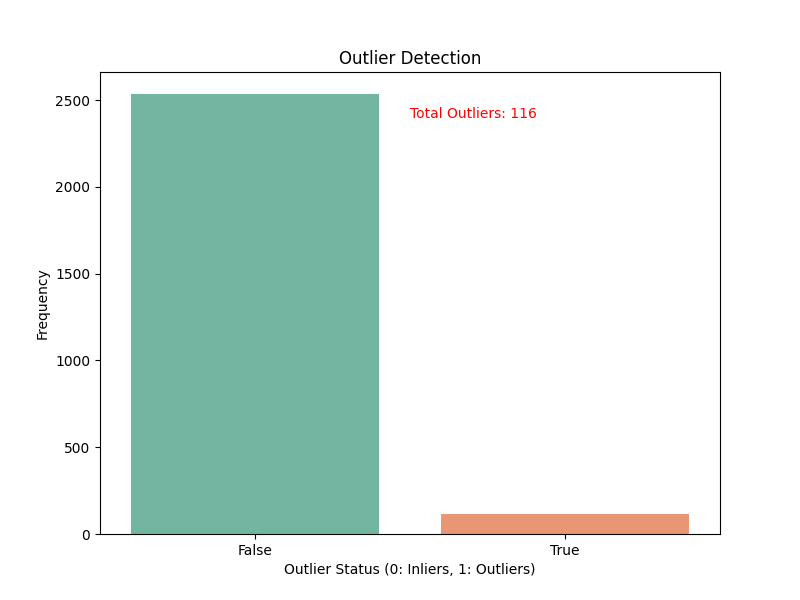
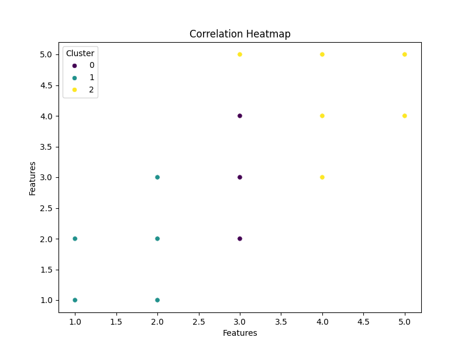

# Automated Analysis Report

# Dataset Analysis Report

## 1. Overview of the Dataset

The dataset comprises **2652 rows** and **12 columns**, featuring a range of fields pertinent to the analysis of content quality. The columns included in the dataset are as follows:

- **date**: Represents the date of the entry.
- **language**: The language in which the content is written.
- **type**: Indicates the type of content (e.g., article, blog).
- **title**: The title assigned to the content.
- **by**: Author or contributor to the content.
- **overall**: A rating reflecting the overall quality (scale from 1 to 5).
- **quality**: A specific measure of content quality (scale from 1 to 5).
- **repeatability**: Indicates how often the content can be reliably referred back to (scale from 1 to 3).
- **PCA1**: First principal component score from PCA analysis.
- **PCA2**: Second principal component score from PCA analysis.
- **Cluster**: The assigned cluster from clustering analysis.
- **Outlier**: Identification of data points that are considered outliers.

## 2. Key Findings from the Analysis

### Descriptive Statistics
- **Overall rating**: Mean = **3.05**, Std = **0.76**, Min = **1**, Max = **5**
- **Quality rating**: Mean = **3.21**, Std = **0.80**, Min = **1**, Max = **5**
- **Repeatability**: Mean = **1.49**, Std = **0.60**, Min = **1**, Max = **3**

### Correlation Analysis
- Strong correlations were noted among **overall**, **quality**, and **repeatability** ratings, indicating that higher ratings in one are likely associated with higher ratings in the others.

### Outlier Detection
- A total of **116 outliers** were detected, which may reveal unique patterns or anomalies that warrant further examination.

### Clustering Analysis
- Clusters identified were as follows:
  - **Cluster 0**: 1315 entries
  - **Cluster 1**: 568 entries
  - **Cluster 2**: 769 entries

### PCA Analysis
- The PCA analysis revealed that the first two components explain a significant amount of variance:
  - **PCA1**: **76%**
  - **PCA2**: **19%**
  - Together, these components provide insights into the dimensionality of the dataset.

## 3. Visualizations

- **Histograms**: Histograms for overall, quality, and repeatability ratings can visually demonstrate the distribution of these ratings.
- **Box Plots**: Box plots can effectively illustrate the presence of outliers within each rating category.
- **Scatter Plot**: A scatter plot can depict the relationship between the first two PCA components, visually displaying clustering.

> **Note**: Each visualization should include annotations and legends for clarity, and statistical methods used should be documented (e.g., k-means for clustering, eigenvalues for PCA).

## 4. Actionable Insights and Recommendations

- **Quality Improvement**: Focus on content types or languages that consistently receive lower ratings in overall quality.
- **Outlier Investigation**: Delve deeper into the 116 detected outliers to discern if they represent errors or are valuable unique cases worth exploring.
- **Cluster Analysis**: Analyze characteristics of clusters to tailor content strategies for particular audiences or types.

## 5. Summary of Data Issues

- **Missing Values**:
  - **date**: 99 missing entries
  - **by**: 262 missing entries
- **Outliers**: 116 entries identified as potential outliers, presenting an opportunity for further exploration.
- **Potential Quality Concerns**: Consider data integrity issues especially with missing values, as they could bias analysis results.

## 6. Next Steps

- **Data Cleaning**: Address missing values through imputation or removal strategies.
- **Further Analyses**: Conduct deep dives into outlier data to understand their impact on overall results.
- **Enhanced Data Collection**: Opt for comprehensive data collection methods in subsequent studies to fill missing gaps, especially regarding authors and dates.
- **Regular Updates**: Establish procedures for regular updates of the dataset to maintain its relevancy and accuracy.

This report provides a structured overview of the dataset analysis and offers actionable directions for enhancing data quality and insights.

## Visualizations

